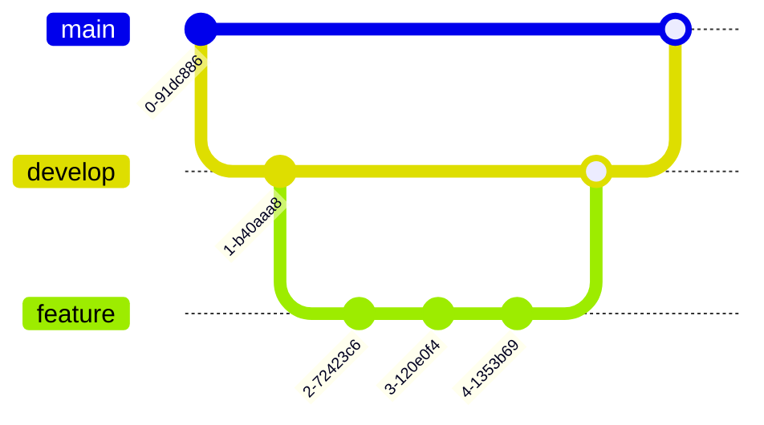

# Tiendas Fiso

## Requerimientos
- Crear un E-commerce para la tienda física.
  - **API independiente para este servicio**
  - [Tienda similar a la que se quiere](https://www.soccer.com/)
- Crear un Dashboard que permita la gestión de productos, etc...
  - Se usará un template [Sakai-PrimeVue](https://sakai.primevue.org/#/?af_id=4218)
- Crear una web para la liga
  - **API independiente para este servicio**
  - [página actual de ligas](https://consola.zione.com.mx/rol.juegos.asp?dts=DTS543&m=1)
  - [KingCup Las Vegas](https://kingcup.vegas/)
  - Está página tiene que tener una membresía mensual en la que te permite principalmente obtener descuentos en el ecommerce y algunas cosas exclusivas dentro de la página.
- App Mobile de la liga

> [!NOTE]
> Está app Mobile, se planteará en un inicio como una PWA, si el cliente no quiere una PWA, se optará por Ionic o Flutter.

## Tecnologías

### E-commerce y Ligas

- Vue
- Typescript
- Pinia
- TailwindCSS
- Vue-Router
- Stripe

> [!NOTE]
> La web de ligas es un proyecto separado que se hará a partir de un template de PWA, para seguir usando Vue. En dado caso se quiera una app nativa se agregara a la lista de tecnologías Ionic o Flutter.

### Dashboard

- Vue
- Prime Vue

### APIs

- Rust -> Actix
- Postgres

## GIT

Se usará la organización ya creada [NexOrbs](https://github.com/nexorbs) con un repositorios privado para el desarrollo de los servicios requeridos.

```txt
📦TiendasFiso
 ┣ 📂ecommerce
 ┣ 📂dashboard
 ┣ 📂ligas
 ┣ 📂mobile            <- Solo si es app nativa
 ┣ 📂backend_ligas
 ┗ 📂backend_ecommerce
```

> [!TIP]
> Sería ideal que el código se mueva a una cuenta en específico del cliente para que el se quede con el código.

### Plataforma

Se optó por usar [github.com](https://github.com) por sus beneficios en el plan gratuito.

Véase en el [pricing](https://docs.github.com/es/get-started/learning-about-github/githubs-plans)

### GIT FLOW



Podemos ver que el flujo de trabajo de GitFlow se divide en las siguientes ramas:

- **main**: Es producción.
- **develop**: Contiene el código en desarrollo.
- **feature**: Contiene las nuevas funcionalidades que se están desarrollando.

Un ejemplo de una rama de Feature sería:

`feature/backend/create-products`

- `feature`: Indica que es una rama de una nueva funcionalidad.
- `backend`: Indica que es una funcionalidad de backend.
- `create-products`: Es el nombre de la tarea.

## Desglose de actividades

### Ecommerce

- $150,000

- [ ] Diseño (5-10 pantallas, diseño funcional y simple)
- [ ] Autentificación y autorización.
    - Login
    - Register
    - Recover Password

#### Tareas completas, tanto como frontend y backend.

- [ ] Landing Page.
- [ ] Página de información (Acerca de, Contacto, Servicios).
- [ ] Carrito de compras y pagos.
- [ ] Productos
    - Página de productos
    - Filtros
    - Recomendaciones

##### Dashboard

- [ ] Diseño (5-10 pantallas, diseño funcional y simple)

Es el panel de adminsitración

- [ ] CRUD básico (Adminsitración de productos, usuarios y noticias)
- [ ] Mostrar estadisticas (Producto más vendido, ingresos, etc...)

### Ligas

- [ ] Diseño (5-10 pantallas, diseño funcional y simple)

#### Tareas completas, tanto como frontend y backend.

- [ ] Página de listado de jugadores
    - Básico:
    - Avanzado:
        - Incluye filtros dinámicos, búsqueda avanzada y ranking en tiempo real.
        - Estadísticas visuales con gráficos o tablas interactivas.
- [ ] Página de blog o noticias
- [ ] Página de perfil de usuario
- [ ] Página de accesos directos (selección de jugadores por posición)

